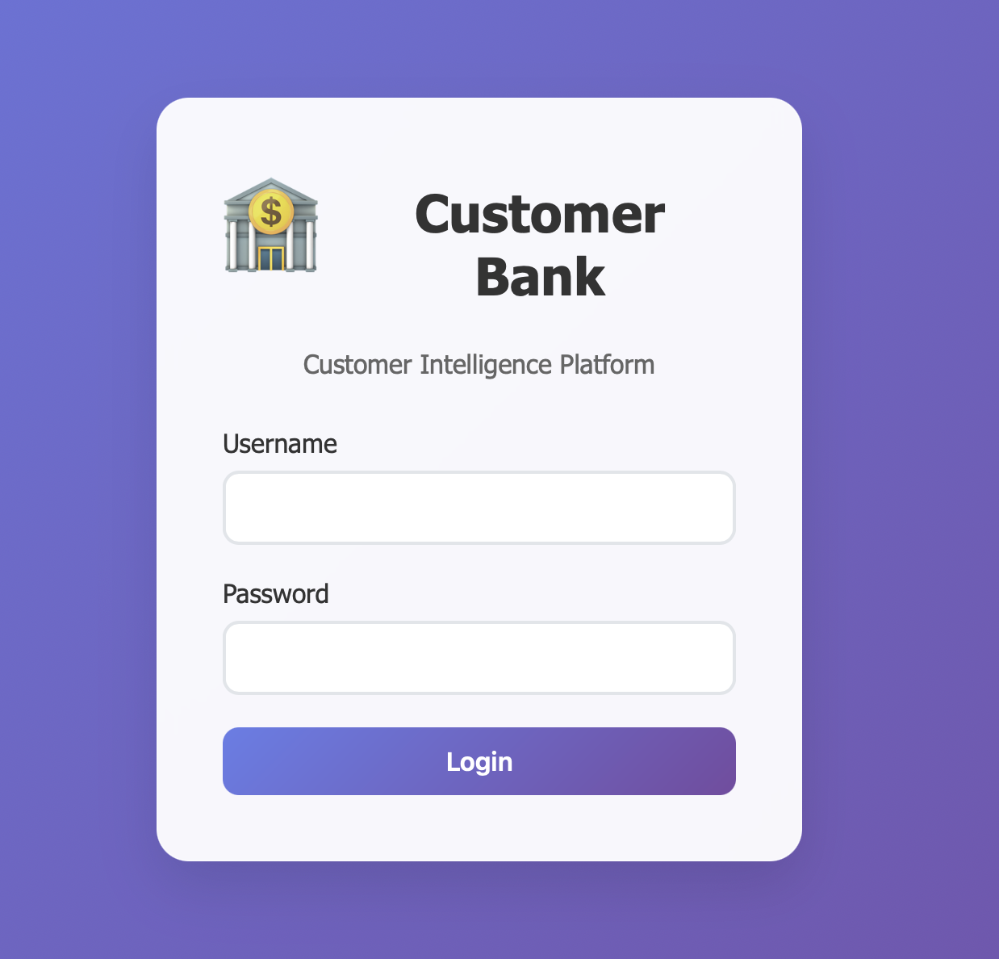
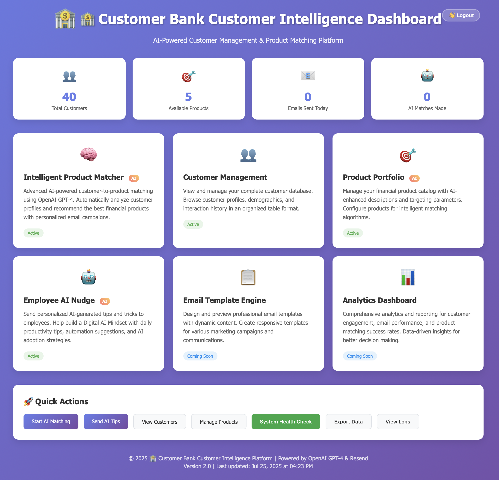

# 🏦 Customer Bank - AI-Powered Customer Intelligence Platform

<div align="center">


**Transform your financial institution with AI-powered customer intelligence and personalized product recommendations**

[🚀 Quick Start](#-quick-start-local-development) • [✨ Features](#-key-features) • [📖 Documentation](#-documentation) • [🔧 Configuration](#-environment-configuration)

</div>

---

## 🎯 What is Customer Bank?

Customer Bank is a cutting-edge **AI-powered customer intelligence platform** designed specifically for financial institutions. It combines advanced machine learning, personalized product matching, and automated marketing to help banks and credit unions:

- **🤖 Generate AI-driven product recommendations** tailored to individual customer profiles
- **📊 Analyze customer data** to identify cross-selling and upselling opportunities
- **📧 Automate personalized email campaigns** with intelligent product matching
- **💡 Empower employees** with AI-generated tips and insights
- **🎨 Create dynamic marketing content** using OpenAI's GPT-4
- **📈 Track customer engagement** and campaign performance

### 🌟 Perfect For
- **Community Banks** looking to compete with larger institutions
- **Credit Unions** wanting to enhance member experience
- **FinTech Startups** building customer-centric products
- **Financial Advisors** seeking data-driven client insights

---

## 📸 Application Screenshots

Get a visual preview of the Customer Bank platform's intuitive interface and powerful features:

### 🔐 **Secure Authentication**

*Clean, professional login interface with randomly generated secure passwords for admin access*

### 📊 **Comprehensive Dashboard**

*Central command center featuring customer analytics, AI insights, and quick access to all platform features*

---

## ✨ Key Features

### 🎯 **AI-Powered Product Matching**
- Intelligent customer-to-product recommendation engine
- Real-time analysis of customer profiles and financial needs
- Confidence scoring for recommendation accuracy
- Batch processing for large customer databases

### 🤖 **AI Product Manager**
- Generate new financial products using AI
- Analyze existing product portfolios
- Create personalized product recommendations
- Generate marketing copy for any channel (email, social, web)

### 📧 **Intelligent Email Campaigns**
- Automated email generation with personalized content
- A/B testing capabilities with different message variations
- Professional email templates with bank branding
- Real-time campaign tracking and analytics

### 👥 **Customer Intelligence Dashboard**
- Comprehensive customer analytics and insights
- Interactive data visualization and reporting
- Customer segmentation and targeting tools
- Notes and relationship management

### 💡 **Employee AI Assistant**
- Daily AI-generated tips for banking professionals
- Personalized recommendations based on employee roles
- Industry-specific insights and best practices
- Email delivery system for team engagement

### 🔧 **Modern Technology Stack**
- **Backend**: Node.js + Express.js for robust server architecture
- **AI/ML**: OpenAI GPT-4 integration for intelligent content generation
- **Email**: Resend API for reliable email delivery
- **Data**: Excel/JSON-based data management with export capabilities
- **Security**: Session-based authentication with secure password generation

---

## 🚀 Quick Start (Local Development)

### 📋 Prerequisites

Before you begin, ensure you have the following installed and configured:

1. **Node.js & npm**
   ```bash
   # Check if you have Node.js installed (version 18+ recommended)
   node --version
   npm --version
   
   # If not installed, download from https://nodejs.org/
   ```

2. **API Keys** (Required for full functionality)
   - **OpenAI API Key**: Sign up at [OpenAI Platform](https://platform.openai.com/)
   - **Resend API Key**: Create account at [Resend](https://resend.com/)

3. **Git** (for cloning the repository)
   ```bash
   git --version
   ```

### ⚡ Installation & Setup

1. **Clone the Repository**
   ```bash
   git clone https://github.com/your-username/customer-app.git
   cd customer-app
   ```

2. **Install Dependencies**
   ```bash
   npm install
   ```

3. **Environment Configuration**
   ```bash
   # Copy the example environment file
   cp .env.example .env
   
   # Edit the .env file with your API keys
   nano .env  # or use your preferred editor
   ```

4. **Configure Environment Variables**
   
   Edit your `.env` file with the following:
   ```env
   # Required API Keys
   OPENAI_API_KEY=sk-your-openai-api-key-here
   RESEND_API_KEY=re_your-resend-api-key-here
   
   # Application Configuration
   NODE_ENV=development
   PORT=3000
   
   # Optional: Custom Configuration
   SESSION_SECRET=your-custom-session-secret
   ```

5. **Start the Application**
   ```bash
   npm start
   ```

6. **Access the Application**
   
   Open your browser and navigate to: **http://localhost:3000**
   
   **Login Credentials**: The application generates a random admin password on startup. Check your console output for:
   ```
   🔐 Admin Login Credentials:
      Username: admin
      Password: [randomly-generated-password]
      Please save these credentials securely!
   ```

### 🎮 Using the Application

Once logged in, you can explore these features:

1. **🏠 Dashboard** (`/`) - Overview of customer intelligence and analytics
2. **👥 Customer Management** (`/customers`) - View and manage customer data
3. **🤖 AI Product Manager** (`/ai-products`) - Generate and manage financial products
4. **🎯 Intelligent Matcher** (`/intelligent-matcher`) - AI-powered customer-product matching
5. **💡 Employee Nudge** (`/employee-nudge`) - AI tips and employee engagement

---

## 🔧 Environment Configuration

### Required Environment Variables

| Variable | Description | Example | Required |
|----------|-------------|---------|----------|
| `OPENAI_API_KEY` | OpenAI API key for AI features | `sk-...` | ✅ Yes |
| `RESEND_API_KEY` | Resend API key for email sending | `re_...` | ✅ Yes |
| `NODE_ENV` | Application environment | `development` | ✅ Yes |
| `PORT` | Server port number | `3000` | ⚠️ Optional |
| `SESSION_SECRET` | Secret for session encryption | `custom-secret` | ⚠️ Optional |

### 📁 Sample Data

The application includes sample customer data in `nudge_customers.xlsx`. To use your own data:

1. **Excel Format**: Ensure your Excel file has columns for:
   - `first_name`, `last_name`, `email`
   - `age`, `income`, `credit_score`
   - `account_balance`, `monthly_spending`
   - Any additional customer attributes

2. **Replace Sample Data**: Replace `nudge_customers.xlsx` with your customer data file

### 🔒 Security Considerations

- **Random Passwords**: Admin password is generated randomly on each startup
- **Environment Variables**: Never commit `.env` files to version control
- **Session Security**: Sessions expire after 24 hours for security
- **HTTPS**: Enable HTTPS in production (see [DEPLOY.md](./DEPLOY.md))

---

## 🛠️ Development & Customization

### 🎨 Branding Customization

The application uses generic "🏦 Customer Bank" branding that can be easily customized:

1. **Company Name**: Update references to "Customer Bank" throughout the codebase
2. **Logo & Colors**: Modify CSS and styling in the `public/` directory
3. **Email Templates**: Customize email templates in `email-engine.js`
4. **Contact Information**: Update phone numbers and email addresses

### 📦 Adding New Features

The modular architecture makes it easy to extend:

- **AI Features**: Extend `ai-product-manager.js` and `intelligent-product-matcher.js`
- **Email Templates**: Modify `email-engine.js` for custom email designs
- **Data Sources**: Integrate with your existing CRM or database systems
- **Authentication**: Replace simple auth with SSO or database-backed authentication

### 🧪 Testing

```bash
# Run the application in development mode
npm run dev

# Test email functionality
curl -X POST http://localhost:3000/api/test-email

# Check API endpoints
curl http://localhost:3000/api/auth-status
```

---

## 📖 Documentation

### 📚 Complete Documentation

- **[DEPLOY.md](./DEPLOY.md)** - Production deployment guide for Digital Ocean
- **[.env.example](./.env.example)** - Example environment configuration
- **API Documentation** - Available at `/api/` endpoints when running locally

### 🔗 Useful Links

- **OpenAI API Documentation**: [https://platform.openai.com/docs](https://platform.openai.com/docs)
- **Resend API Documentation**: [https://resend.com/docs](https://resend.com/docs)
- **Node.js Documentation**: [https://nodejs.org/docs](https://nodejs.org/docs)

### 🆘 Troubleshooting

**Common Issues:**

1. **"Module not found" errors**
   ```bash
   rm -rf node_modules package-lock.json
   npm install
   ```

2. **OpenAI API errors**
   - Verify your API key is correct and has sufficient credits
   - Check the OpenAI API status page

3. **Email sending fails**
   - Ensure your Resend API key is valid
   - Check that your domain is verified in Resend

4. **Port already in use**
   ```bash
   # Use a different port
   PORT=3001 npm start
   ```

---

## 🤝 Contributing & Support

### 💻 Contributing

We welcome contributions! Here's how to get started:

1. Fork the repository
2. Create a feature branch (`git checkout -b feature/amazing-feature`)
3. Commit your changes (`git commit -m 'Add amazing feature'`)
4. Push to the branch (`git push origin feature/amazing-feature`)
5. Open a Pull Request

### 📞 Support

- **Issues**: Report bugs and request features via GitHub Issues
- **Documentation**: Check [DEPLOY.md](./DEPLOY.md) for deployment questions
- **Community**: Join our discussions for tips and best practices

---

<div align="center">

**⭐ Star this repository if you find it useful!**

Made with ❤️ for the financial services industry

[🚀 Get Started](#-quick-start-local-development) • [📖 Read Docs](./DEPLOY.md) • [🐛 Report Issues](../../issues)

</div>
